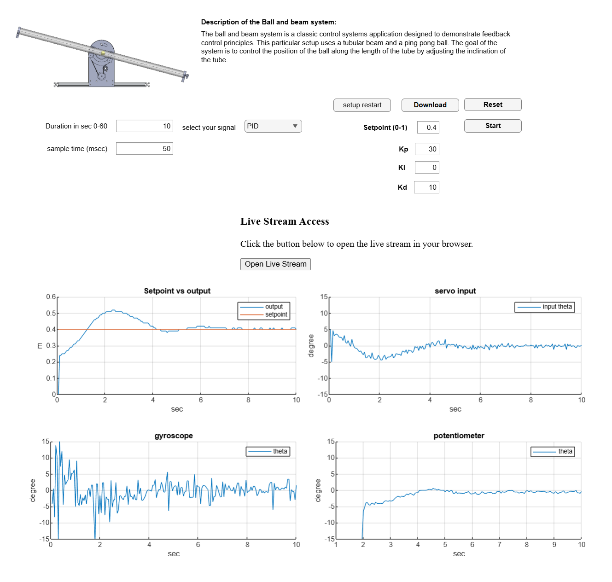

# Ball & Beam System – Embedded Nonlinear Control

---

## 1. Project Context
The **Ball & Beam** system is a classical benchmark in **control theory**, widely
used in education and research due to its **nonlinear and unstable nature**.

This project aims to implement a **real embedded control system**, in which the
**position of a ball rolling on a beam** is indirectly controlled by adjusting
the **inclination angle of the beam** using an actuator.

The main objective is to demonstrate the complete implementation of a
**real-time embedded control system on a microcontroller**, including
measurement, control computation, actuation, and supervision.

🎥 **Video demonstration**  

👉 <https://www.youtube.com/watch?v=WiT9M9kRNLs&list=PLP_rFSxPx1fHSOocTPxHAXtn5v9XiCN_c>

---

## 2. Physical System Description and Global Architecture

The system consists of an **inclined beam**, on which a **ball can move freely**
under the effect of gravity.  
The inclination of the beam is controlled by a **servo motor**, allowing the
dynamics of the ball motion to be modified.

Two physical quantities are measured:
- the **position of the ball** along the beam,
- the **inclination angle of the beam**.

These measurements are used by the embedded controller to compute the control
command applied to the actuator.

---

## 3. Instrumentation and Measurement Acquisition

### Sensors Used
- **VL53L0X distance sensor**  
  → measurement of the **ball position** \( x(t) \)
- **MPU6050 inertial sensor**  
  → measurement of the **beam angle** \( \theta(t) \)

Both sensors communicate with the microcontroller via an **I²C bus**, ensuring
synchronous and reliable data acquisition.

---

## 4. Control Objective and Problem Formulation

### Objective
The objective of the control system is to:
> **regulate the ball position \( x(t) \) around a reference position
> \( x_{ref}(t) \)**

The manipulated variable is:
- the **beam angle** \( \theta \), controlled via the servo motor.

### Position Error
The control error is defined as:
\[
e_x(t) = x_{ref}(t) - x(t)
\]

The controller then computes an **angular command**:
\[
\theta_{cmd}(t)
\]
which is applied to the servo motor.

This indirect control structure makes the system **nonlinear**, since the ball
position depends on the acceleration induced by the beam angle.

---

## 5. Embedded Real-Time Control

### Embedded Platform
- **Microcontroller:** ESP32
- Development in **C / C++**
- Control executed in **real time** on the embedded board

### Control Strategy
- The embedded controller (PID-based) uses:
  - the position error \( e_x(t) \)
  - sensor measurements
- The controller output is the **angular command** \( \theta_{cmd} \)
- This command is sent to the servo motor as a **PWM signal**

⚠️ All control computations are performed **exclusively on the ESP32**, with no
dependence on external computation.

---

## 6. Actuation

- **Servo motor** controlling the beam inclination
- Direct control from the ESP32
- Conversion of \( \theta_{cmd} \) into a PWM signal

This choice enables fast and repeatable actuation, compatible with the real-time
constraints of the system.

---

## 7. Supervision and Graphical Interface

A supervision interface was developed using **MATLAB App Designer**.

### Role of MATLAB
- Definition of the reference position \( x_{ref}(t) \)
- Experiment configuration
- Visualization of measurements and time responses
- Storage of experimental data

### Communication
- **HTTP protocol**
- MATLAB acts as a **client**
- The ESP32 acts as a **server**

MATLAB does **not** participate in the control loop, ensuring the autonomy and
real-time nature of the embedded system.

---

## 8. Nonlinear Nature of the System

The Ball & Beam system exhibits several sources of nonlinearity:
- nonlinear relationship between beam angle and ball acceleration,
- dynamic coupling between position and velocity,
- presence of friction and gravitational effects.

These characteristics make this setup a **relevant benchmark for testing and
comparing control strategies** on real nonlinear systems.

---

## 9. Results and Technical Contributions

This project made it possible to:
- implement a **complete embedded control system**,
- integrate multiple sensors on an I²C bus,
- control a nonlinear system in real time,
- clearly separate **embedded control** and **external supervision**,
- obtain an experimental setup suitable for educational and research purposes.

---

## 10. Future Work
- Implementation of cascade control (position loop / angle loop)
- Comparison between PID and advanced control strategies
- Dynamic model identification
- Integration with a digital twin

