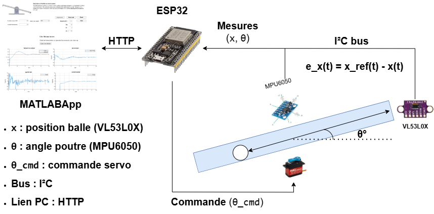

# Système Ball & Beam – Contrôle non linéaire embarqué

🎥 *Démonstration vidéo disponible via le portfolio*  

---

## 1. Contexte du projet
Le système **Ball & Beam** est un banc d’essai classique en **théorie du contrôle**, largement utilisé pour l’enseignement et la recherche en raison de son **caractère non linéaire et instable**.

Ce projet vise à implémenter un **système réel de contrôle embarqué**, dans lequel la **position d’une balle roulant sur une poutre** est contrôlée indirectement en ajustant **l’angle d’inclinaison de la poutre** à l’aide d’un actionneur.

L’objectif principal est de démontrer la mise en œuvre complète d’un **système de contrôle temps réel sur microcontrôleur**, incluant la mesure, le calcul de la commande, l’actionnement et la supervision.

---

## 2. Description du système physique et architecture globale

Le système est constitué d’une **poutre inclinable**, sur laquelle une **balle peut se déplacer librement** sous l’effet de la gravité.  
L’inclinaison de la poutre est commandée par un **servomoteur**, permettant de modifier la dynamique du déplacement de la balle.

Deux grandeurs physiques sont mesurées :
- la **position de la balle** le long de la poutre,
- l’**angle d’inclinaison de la poutre**.

Ces mesures sont utilisées par le contrôleur embarqué afin de calculer la commande à appliquer à l’actionneur.

---

## 3. Instrumentation et acquisition des mesures

### Capteurs utilisés
- **Capteur de distance VL53L0X**  
  → mesure de la **position de la balle** \( x(t) \)
- **Capteur inertiel MPU6050**  
  → mesure de l’**angle de la poutre** \( \theta(t) \)

Les deux capteurs communiquent avec le microcontrôleur via un **bus I²C**, garantissant une acquisition synchrone et fiable des mesures.

---

## 4. Objectif de contrôle et formulation du problème

### Objectif
L’objectif du système de contrôle est de :
> **réguler la position de la balle \( x(t) \) autour d’une position de référence \( x_{ref}(t) \)**

La variable manipulée est :
- l’**angle de la poutre** \( \theta \), commandé via le servomoteur.

### Erreur de position
L’erreur de contrôle est définie par :
\[
e_x(t) = x_{ref}(t) - x(t)
\]

Le contrôleur calcule alors une **commande angulaire** :
\[
\theta_{cmd}(t)
\]
qui est appliquée au servomoteur.

Ce type de commande indirecte rend le système **non linéaire**, car la position de la balle dépend de l’accélération induite par l’angle de la poutre.

---

## 5. Contrôle embarqué temps réel

### Plateforme embarquée
- **Microcontrôleur : ESP32**
- Développement en **C / C++**
- Exécution du contrôle en **temps réel** sur la carte embarquée

### Stratégie de contrôle
- Le contrôleur embarqué (de type **PID**) utilise :
  - l’erreur de position \( e_x(t) \)
  - les mesures capteurs
- La sortie du contrôleur est la **commande angulaire** \( \theta_{cmd} \)
- Cette commande est transmise au servomoteur sous forme de **signal PWM**

⚠️ L’ensemble du calcul de commande est réalisé **exclusivement sur l’ESP32**, sans dépendance à un calcul externe.

---

## 6. Actionnement

- **Servomoteur** pilotant l’inclinaison de la poutre
- Commande directe depuis l’ESP32
- Conversion de \( \theta_{cmd} \) en signal PWM

Ce choix permet une réponse rapide et reproductible, compatible avec les contraintes temps réel du système.

---

## 7. Supervision et interface graphique

Une interface de supervision a été développée sous **MATLAB App Designer**.

### Rôle de MATLAB
- Définition de la position de référence \( x_{ref}(t) \)
- Paramétrage des expériences
- Visualisation des mesures et des réponses temporelles
- Sauvegarde des données expérimentales

### Communication
- **Protocole HTTP**
- MATLAB agit comme **client**
- L’ESP32 agit comme **serveur**

MATLAB n’intervient **pas** dans la boucle de contrôle, garantissant l’autonomie et le caractère temps réel du système embarqué.

---

## 8. Caractère non linéaire du système

Le système Ball & Beam présente plusieurs sources de non-linéarité :
- relation non linéaire entre l’angle de la poutre et l’accélération de la balle,
- couplage dynamique entre position et vitesse,
- présence de frottements et d’effets gravitationnels.

Ces caractéristiques font de ce banc un **outil pertinent pour tester et comparer des stratégies de contrôle** sur des systèmes réels non linéaires.

---

## 9. Résultats et apports techniques

Ce projet a permis de :
- mettre en œuvre un **système de contrôle embarqué complet**,
- intégrer plusieurs capteurs sur un bus I²C,
- contrôler un système non linéaire en temps réel,
- séparer clairement **contrôle embarqué** et **supervision externe**,
- disposer d’un banc expérimental exploitable à des fins pédagogiques et de recherche.

---

## 10. Perspectives d’évolution
- Mise en place d’une commande en cascade (boucle position / boucle angle)
- Comparaison PID / contrôle avancé
- Identification du modèle dynamique
- Intégration avec un jumeau numérique

---

🔗 **Code source et documentation** : disponibles sur demande ou via GitHub
