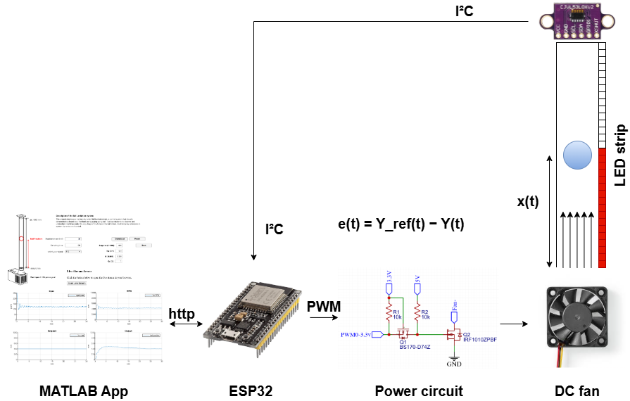

# Ball Levitation – Nonlinear Control System

## 1. Project Context
This project focuses on the development of a **ball levitation system** intended
for **control engineering education** and for the **experimental validation of
control laws** on a real physical system.

The setup implements an **unstable nonlinear system**, commonly used as a test
bench to illustrate the fundamental differences between **open-loop control**
and **closed-loop control**.

🎥 **Video demonstration**

👉 <https://www.youtube.com/shorts/atcOL_jQtLA>

---

## 2. Physical System Description
The system consists of:

- A **transparent vertical tube**
- A **DC fan** located at the base of the tube
- A **ping-pong ball** inside the tube
- A **distance sensor** measuring the vertical position of the ball
- An **addressable LED strip** integrated into the tube for real-time
  visualization of the ball position

The objective is to **maintain the ball at a desired vertical position** by
controlling the rotational speed of the fan.

---

## 3. Embedded Architecture

### Hardware
- Microcontroller: **ESP32**
- Actuator: DC fan (PWM control)
- Sensor: distance sensor
- Visual interface: addressable LED strip

### Embedded Software
- Development in **C / C++**
- Control loop executed **directly on the ESP32**
- Fully embedded control to guarantee **real-time operation**

---

## 4. Implemented Control Strategies

### Open-Loop Control
Several open-loop control scenarios were implemented:
- Step response
- Sinusoidal excitation
- Square-wave excitation

These scenarios allow observation of the nonlinear and unstable behavior of the
system.

---

### Closed-Loop Control
Closed-loop control strategies were developed:

- **PID control with fixed reference**
- **PID control with sinusoidal reference**

These modes make it possible to analyze:
- system stability
- tracking accuracy
- transient dynamics

---

## 5. Graphical Interface and Communication

A **graphical user interface (GUI)** was developed using **MATLAB App Designer**.

### Communication
- Protocol: **HTTP**
- The ESP32 acts as the server
- MATLAB acts as the supervision client

⚠️ Control computation is **performed exclusively on the ESP32**.  
MATLAB is used only to:
- define parameters (PID gains, experiment duration, scenario type)
- launch experiments
- retrieve measured data

---

## 6. Data Acquisition and Processing
At the end of each experiment:
- Measured data are transmitted to MATLAB
- Data are stored as **.txt** files
- Plots are generated automatically (position, reference, control signal)

The user can then exploit these data for:
- system analysis
- comparison of control strategies
- control engineering education

---

## 7. Educational and Scientific Objectives

### Educational Objectives
- Concrete illustration of the differences between open-loop and closed-loop control
- Understanding of the role of the PID controller
- Awareness of nonlinear system behavior

### Scientific Objectives
- Experimental test bench for testing and comparing control laws
- Experimental platform for control strategy validation

---

## 8. Key Project Highlights
- **Nonlinear system**
- **Embedded real-time control**
- Clear separation between supervision and control
- Educational and reusable architecture
