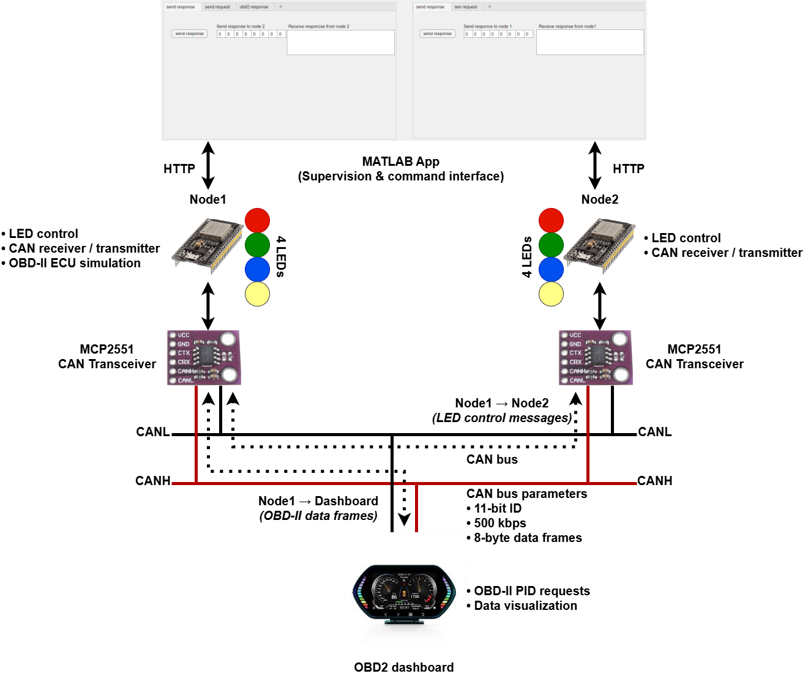
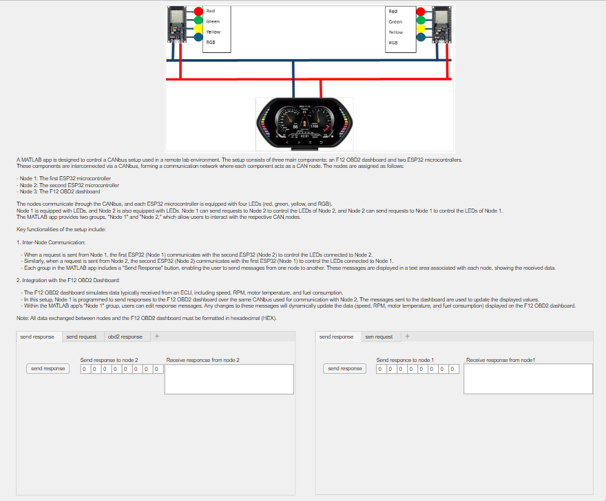

# Multi-Node CAN Network and OBD-II Communication

---

## 1. Project Context
This project aims to design and implement a **multi-node CAN (Controller Area Network)** inspired by architectures used in **automotive and industrial systems**.

The objective is to demonstrate:
- **low-level CAN communication** between microcontrollers,
- the design of **application-level messages**,
- the integration of an **OBD-II dashboard** simulating an ECU,
- and system supervision via a **MATLAB application**.

The system is based on real hardware components and operates on a **physical CAN bus**.

---

## 2. Global System Architecture

The CAN network is composed of **three main nodes**:
- two **ESP32 microcontrollers**,
- one **OBD-II dashboard (F12)**.

The nodes are interconnected via a **differential CAN bus (CANH / CANL)**.

---

## 3. Description of CAN Nodes

### Node 1 – ESP32 (Main Node)
- Control of local LEDs (R, G, B, RGB)
- **CAN transmission and reception**
- Simulation of an **OBD-II ECU**
- Transmission of CAN frames to the F12 dashboard

### Node 2 – ESP32 (Peer Node)
- Control of local LEDs
- **CAN transmission and reception**
- Bidirectional communication with Node 1

### Node 3 – OBD-II Dashboard (F12)
- Transmission of **OBD-II PID requests**
- Display of vehicle data:
  - speed
  - engine speed (RPM)
  - engine temperature
  - fuel consumption

---

## 4. Hardware Layer and CAN Interface

Each ESP32 is connected to the CAN bus via an **MCP2551 CAN transceiver**, which provides the interface between:
- the microcontroller (logic level),
- the differential CAN bus (CANH / CANL).

### CAN Bus Parameters
- Identifiers: **11-bit**
- Bit rate: **500 kbps**
- Frame length: **8 bytes**

This configuration complies with automotive CAN standards.

---

## 5. Inter-Node Communication (ESP32 ⇄ ESP32)

The two ESP32 nodes communicate in a **bidirectional** manner, without a master/slave hierarchy.

### Implemented Functionalities
- Transmission of CAN commands for **remote LED control**
- Reception and decoding of CAN frames
- Brightness (PWM) and color (RGB) management

The application-level CAN messages are structured to carry:
- activation/deactivation bits,
- PWM values,
- color codes.

---

## 6. OBD-II Communication and ECU Simulation

### OBD-II Requests
The F12 dashboard sends standardized CAN requests:
- ID `0x7DF` (broadcast)
- Mode `0x01`
- Multiple PIDs (RPM, speed, temperature, consumption)

### Simulated ECU Responses
Node 1 acts as a **simulated ECU**:
- analysis of OBD-II requests,
- generation of **multi-frame responses** (ISO 15765-4),
- transmission of data to the dashboard.

This part of the project demonstrates an understanding of:
- **OBD-II PIDs**,
- **flow control mechanisms**,
- consecutive CAN frames.

---

## 7. Supervision via MATLAB

An application developed using **MATLAB** enables:
- supervision of the CAN network,
- transmission of commands to both ESP32 nodes,
- observation of message exchanges.

⚠️ MATLAB is **not** a CAN node:
- it acts solely as a **supervision interface**,
- real-time processing and CAN communication are handled by the ESP32s.

This separation reflects a **realistic industrial architecture**.

---

## 8. Results and Technical Contributions

This project made it possible to:
- design a **functional multi-node CAN network**,
- implement **peer-to-peer communication** between microcontrollers,
- develop **CAN application-level protocols**,
- understand and decode **OBD-II messages**,
- integrate hardware, firmware, and software supervision.

---

## 9. Future Work
- Addition of new CAN nodes
- Hardware filtering of CAN frames
- Extension to CAN FD
- Integration with an advanced diagnostic system
- CAN frame logging and analysis

