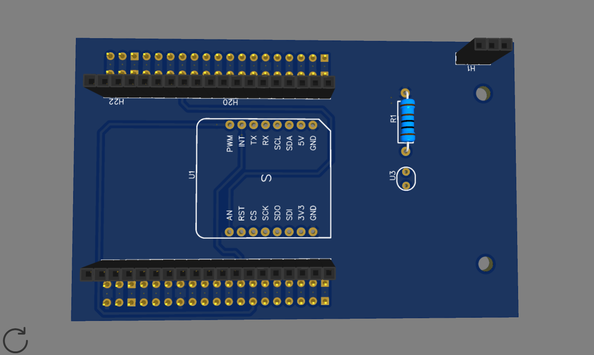
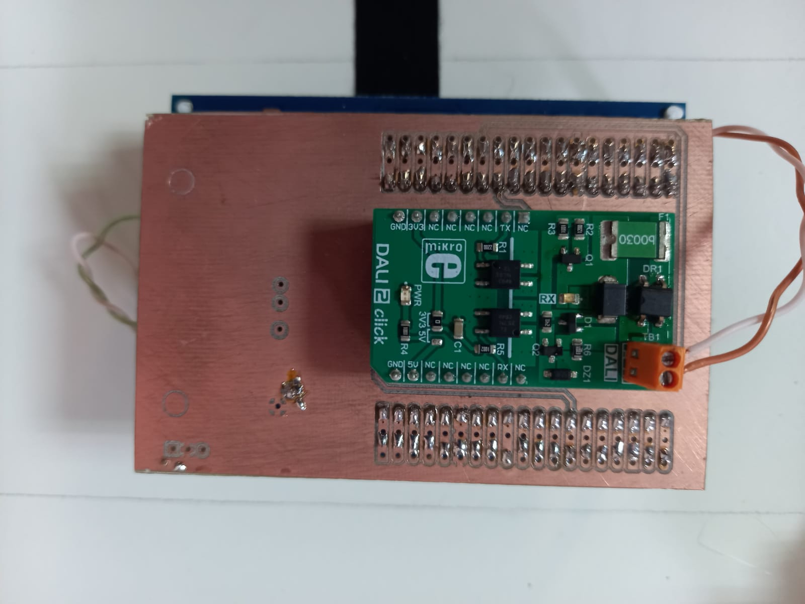
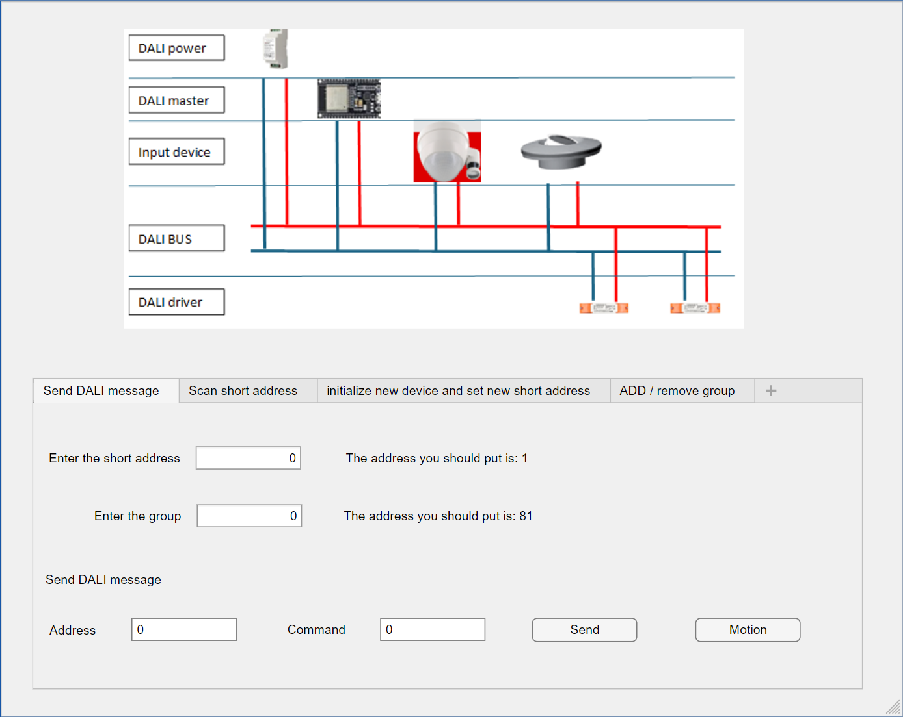

# Smart Lighting System Based on DALI

## 1. Project Context
This project focuses on the development of a **smart lighting system** using the
**DALI (Digital Addressable Lighting Interface)** protocol, widely used in
tertiary and industrial buildings.

The objective is to design an **embedded and interoperable solution** enabling
both individual and group control of luminaires, with the integration of sensors
and automation scenarios.

---

## 2. Technical Objectives
- Implement **DALI communication** on a microcontroller
- Control addressable luminaires (ON/OFF, dimming)
- Integrate sensors for adaptive lighting
- Develop a robust and scalable architecture

---

## 3. System Architecture

### Hardware
- Microcontroller: **ESP32**
- DALI interface (Manchester encoding, 16 V bus)
- Sensors:
  - motion detector
  - ambient light sensor (LDR)
- Power supply and power interface adapted to the DALI bus

### Embedded Software
- Development in **C / C++**
- Management of DALI frames:
  - short and group addressing
  - direct commands and scenarios
- Clear separation between:
  - sensor acquisition
  - DALI communication
  - control logic

---

## 4. PCB Design (ESP32 → DALI-2 Click Shield)

To facilitate hardware integration and obtain a reproducible setup, I designed a
**PCB shield** allowing the connection of the **laboratory ESP32 development
board** (previously developed) to a **DALI-2 Click module**.

This shield provides:
- **clean interconnection** (connectors, signals, power)
- **reduced wiring errors** compared to breadboard-based assemblies
- improved **mechanical robustness** for testing and demonstrations

---

## 5. Implemented Functionalities

- **Individual luminaire control** using short addressing
- **Group control of luminaires** (group addressing)
- **Light intensity control** (dimming)
- **Presence detection** for automatic lighting activation
- **Automatic DALI bus scanning** to detect connected drivers
- **Assignment and modification of short addresses** for DALI drivers
- **Creation and management of DALI groups**
- **Automatic lighting adjustment** based on ambient light level

---

## 6. Communication and Supervision
The system can be supervised via:
- a **MATLAB App** interface
- network communication (depending on configuration)

The architecture is designed to be compatible with **Building Management
Systems (BMS)**.

---

## 7. Tools and Technologies Used
- **Microcontroller:** ESP32  
- **Protocol:** DALI  
- **Languages:** C / C++  
- **Sensors:** PIR, LDR  
- **Tools:** Arduino IDE, Git  

---

## 8. Results and Technical Achievements
- In-depth understanding of the DALI protocol and its physical constraints
- Implementation of reliable real-time communication
- Design of a modular smart lighting system
- Understanding of smart building lighting challenges

---

## 9. Future Work
- Integration of an advanced user interface
- Connection to an IoT platform
- Energy management and usage statistics
- Extension to multi-zone installations

