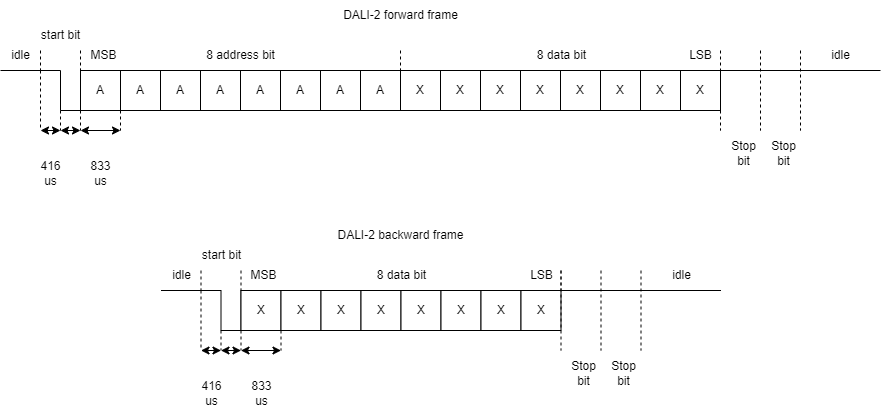

# PCB Design & Hardware Interfaces

This project presents a collection of **custom PCB designs** developed for
embedded systems, communication interfaces, and laboratory prototypes.

The focus is on:
- hardware integration and interfacing
- rapid prototyping for research applications
- robust and reproducible electronic design

All PCBs are designed using professional CAD tools and follow good engineering
practices (signal integrity, power routing, modularity).

---

## 1. Interface & Shield Boards

PCBs designed to interface existing development boards with external modules,
communication buses, or power stages.  
These boards improve wiring reliability and system robustness compared to
breadboard-based solutions.

> **Typical use cases:** communication interfaces, protocol adapters,
laboratory test setups.

---

## 2. Standalone Control Boards

Custom PCBs integrating a microcontroller and peripheral circuits on a single
board, intended for autonomous operation.

> **Typical use cases:** embedded control, sensor acquisition, actuator driving.

---

## 3. Measurement & Signal Conditioning Boards

PCBs dedicated to signal acquisition, conditioning, or measurement, designed to
interface sensors with embedded controllers.

> **Typical use cases:** analog front-end, sensor interfacing, data acquisition.

---

## 4. Design Tools & Workflow

- PCB CAD: EasyEDA / KiCad  
- Schematic-driven design  
- 3D mechanical verification  
- Design for prototyping and lab validation  

Fabrication and validation are performed when required by the project timeline.

---

## 5. Notes on Project Status

Some PCBs presented here are:
- fully fabricated and tested
- at design or layout stage
- awaiting fabrication

Each board is **clearly labeled with its current status** to distinguish between
design work and validated hardware.

This page is updated progressively as designs are fabricated and tested.
