# Conception de PCB & Interfaces matérielles

Ce projet présente une collection de **circuits imprimés (PCB) personnalisés**
développés pour des systèmes embarqués, des interfaces de communication et des
prototypes de laboratoire.

L’accent est mis sur :
- l’intégration et l’interfaçage matériel
- le prototypage rapide pour des applications de recherche
- une conception électronique robuste et reproductible

Tous les PCB sont conçus à l’aide d’outils de CAO professionnels et respectent
les bonnes pratiques d’ingénierie (intégrité du signal, routage de puissance,
modularité).

---

## 1. Cartes de commande autonomes

PCB personnalisés intégrant un microcontrôleur et des circuits périphériques sur
une seule carte, destinés à un fonctionnement autonome.

> **Cas d’usage typiques :** commande embarquée, acquisition de capteurs,
pilotage d’actionneurs.

### Carte de commande de moteur linéaire brushless (commutation par capteurs Hall)

**Type :** Carte d’interface de commande moteur autonome  
**Objectif :** Commande et commutation d’un moteur linéaire brushless à l’aide de capteurs Hall  
**Capteurs :** 3 capteurs de position à effet Hall  
**Statut :** Conception finalisée – fabrication en attente

Cette carte est conçue pour commander un **moteur linéaire brushless** à partir
du retour de **trois capteurs à effet Hall**, permettant une commutation
dépendante de la position et un contrôle précis du mouvement.

La carte assure :
- l’acquisition et le conditionnement des signaux des capteurs Hall
- la génération des signaux de commande moteur
- l’interfaçage avec un contrôleur externe ou un étage de puissance
- un routage structuré des signaux critiques en temps réel

La conception cible des applications de laboratoire et de recherche nécessitant
une commande de mouvement précise et une intégration modulaire avec des
contrôleurs de plus haut niveau.

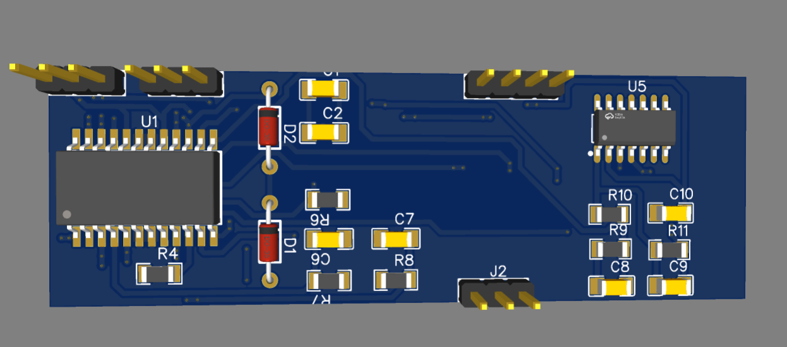

### Carte de commande d’électroaimant et de mesure de la position de la bille

**Type :** Carte autonome de commande et de mesure  
**Objectif :** Actionnement d’un électroaimant et mesure de la position de la bille  
**Capteur :** Capteur à effet Hall (sortie analogique)  
**Application :** Expérience de lévitation magnétique de bille  
**Statut :** Conception finalisée – fabrication en attente

Cette carte est conçue pour la **commande en boucle fermée d’un électroaimant**
associée à la **mesure de la position de la bille** à l’aide d’un capteur à effet
Hall.

La carte intègre :
- un étage de commutation de puissance pour la commande de l’électroaimant
  (MOSFET + diode de protection)
- un conditionnement analogique du signal à l’aide d’un **amplificateur
  opérationnel LM324**
- une interface capteur à effet Hall pour la mesure de position
- une sortie analogique routée vers l’ADC d’un contrôleur externe

L’architecture sépare les chemins de puissance et de mesure, rendant la carte
particulièrement adaptée aux bancs expérimentaux de commande et à la validation
en temps réel.

---

## 2. Cartes de mesure et de conditionnement du signal

### Carte d’interface CCD linéaire TCD1304DG

**Type :** Carte d’interface de mesure et de capteur  
**Objectif :** Acquisition de données de position à partir d’un capteur CCD
linéaire TCD1304DG  
**Application :** Mesure de la position d’une bille dans une expérience de
lévitation magnétique  
**Statut :** Fabriquée et intégrée dans un montage expérimental

Cette carte interface un **capteur CCD linéaire TCD1304DG** avec un
**microcontrôleur ESP32** afin de réaliser une mesure optique de position basée
sur la détection d’ombre.

La carte fournit :
- l’interfaçage électrique du capteur CCD
- le routage des signaux d’horloge et de commande
- l’acquisition et le prétraitement des données sur ESP32
- une **communication UART** vers un contrôleur externe pour une commande en
  boucle fermée

Le PCB a été fabriqué et intégré avec succès dans un banc de lévitation
magnétique utilisé pour des expériences de commande.

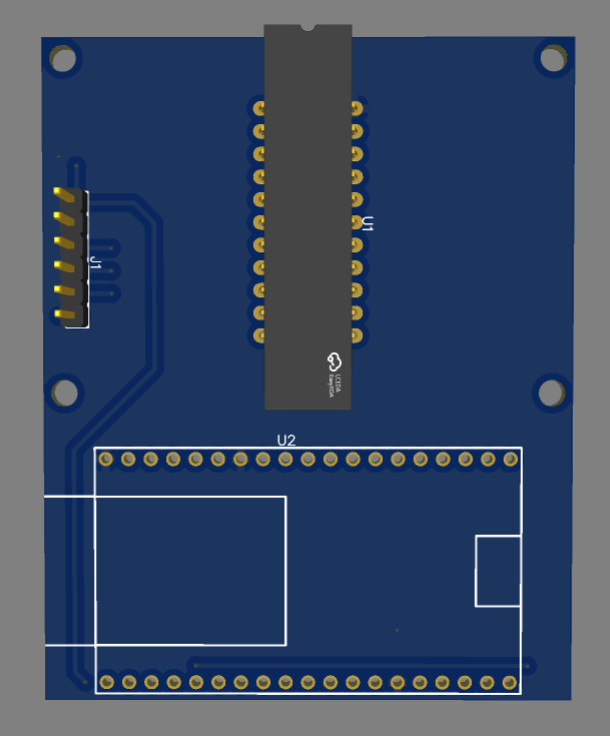
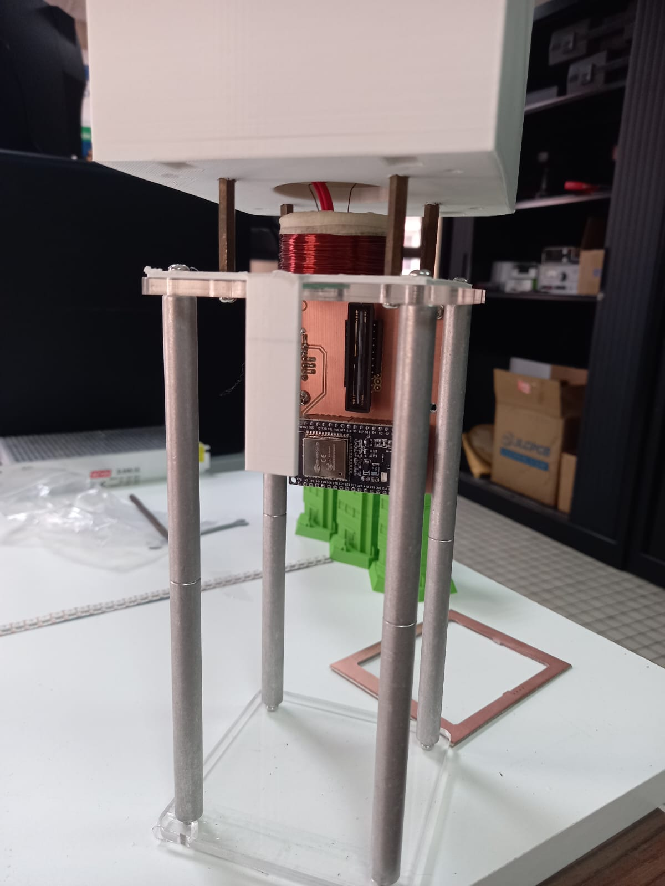
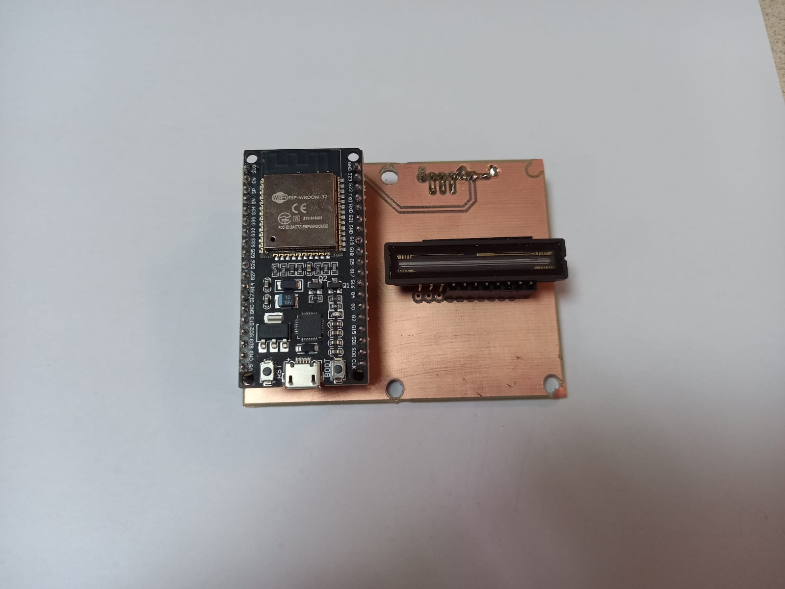

---

## 3. Cartes d’interface et shields

PCB conçus pour interfacer des cartes de développement existantes avec des
modules externes, des bus de communication ou des étages de puissance.  
Ces cartes améliorent la fiabilité du câblage et la robustesse du système par
rapport aux solutions basées sur des breadboards.

> **Cas d’usage typiques :** interfaces de communication, adaptateurs de
protocole, bancs de test de laboratoire.

### Shield d’interface ESP32 ↔ Driver moteur Arduino

**Type :** Carte d’interface / shield  
**Objectif :** Adaptation mécanique et électrique entre ESP32 et drivers moteur
au format Arduino Uno  
**Application :** Expériences de commande moteur avec ESP32 et drivers compatibles Arduino  
**Statut :** Conception finalisée – fabrication en attente

Ce PCB est un **shield d’interface** conçu pour connecter un **driver moteur au
format Arduino Uno** à un **système de commande basé sur ESP32**.

Le shield assure :
- l’adaptation de l’empreinte mécanique entre drivers Arduino Uno et connecteurs ESP32
- le routage direct des signaux de commande et d’alimentation
- une alternative propre et fiable au câblage manuel

Cette approche permet la réutilisation de drivers moteur Arduino existants tout
en bénéficiant des capacités de calcul et de communication de l’ESP32.

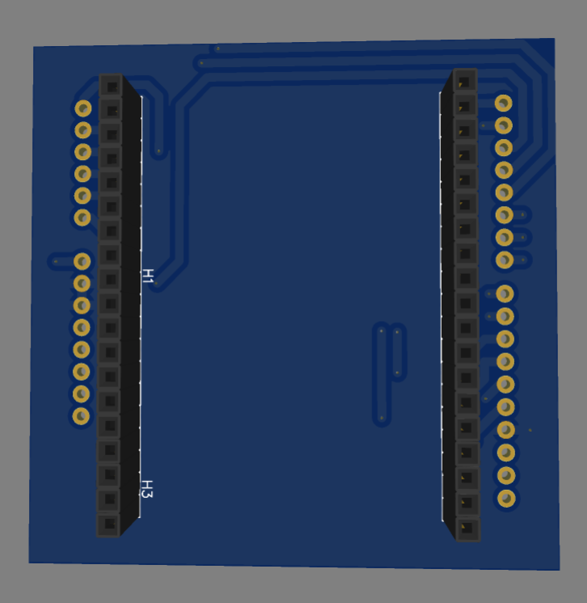

### Plateforme de développement ESP32 du laboratoire

Plusieurs cartes d’interface et shields présentés dans ce projet sont conçus
pour fonctionner avec une **carte de développement ESP32 personnalisée
développée au sein de notre laboratoire**.

Cette carte de développement fournit :
- une **alimentation d’entrée 12 V DC**
- des sorties régulées **3,3 V et 5 V** intégrées (jusqu’à 2 A)
- un ESP32 alimenté directement par le rail **3,3 V**
- un connecteur GPIO standardisé (interface shield) pour l’extension matérielle

Cette plateforme est utilisée comme **cœur commun de commande et de
communication** dans plusieurs expériences de laboratoire et de recherche.

### Approche d’extension matérielle basée sur des shields

Afin de garantir la modularité, la reproductibilité et le prototypage rapide,
une **architecture matérielle basée sur des shields** a été adoptée autour de la
carte de développement ESP32 du laboratoire.

Chaque shield est conçu pour :
- connecter un périphérique, un capteur, un actionneur ou une interface de communication spécifique
- réutiliser les rails d’alimentation communs (3,3 V / 5 V) et la disposition des GPIO
- éviter le câblage manuel et les connexions sur breadboard
- permettre une reconfiguration rapide entre différentes expériences

En conséquence, **plusieurs shields dédiés** ont été développés pour interfacer
la même plateforme ESP32 avec différents systèmes, notamment la commande
d’éclairage, les drivers moteurs, les capteurs et les interfaces d’actionneurs.

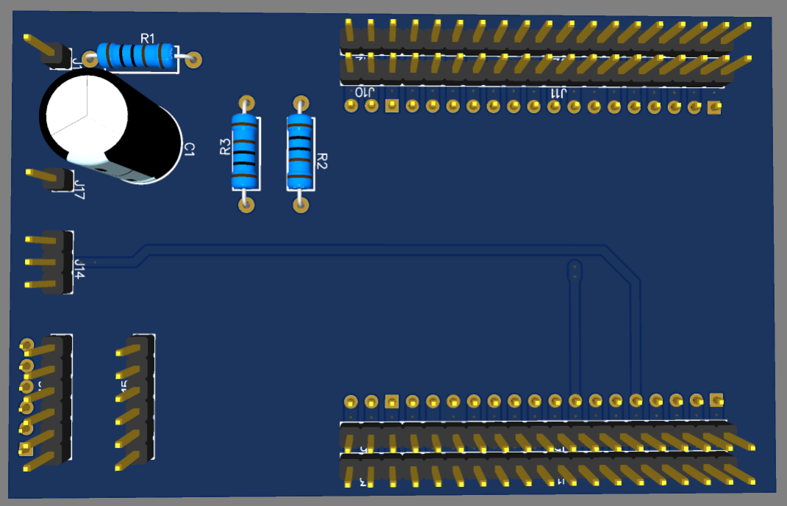
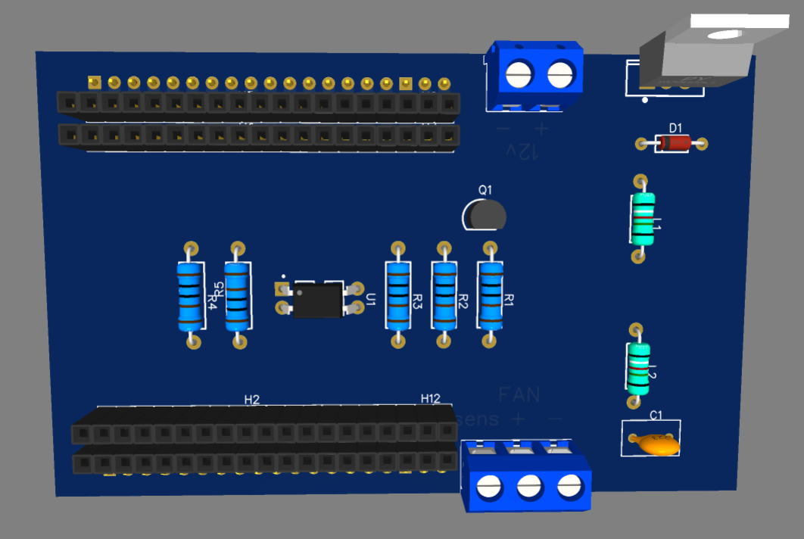
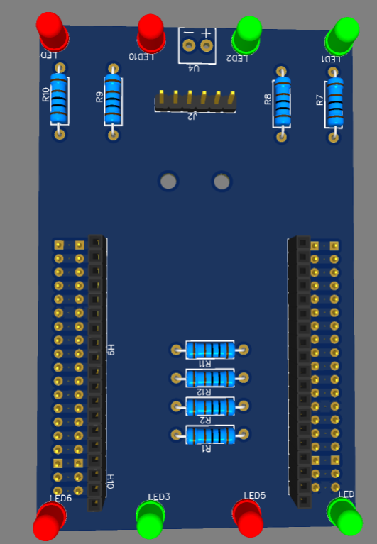
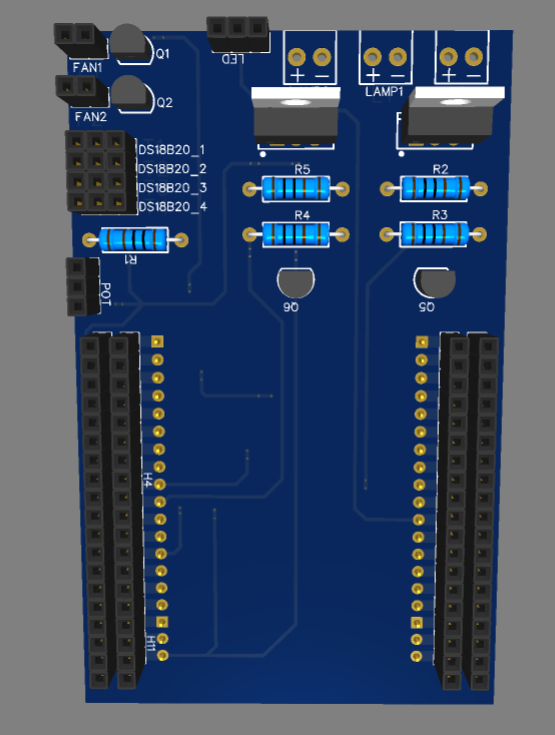
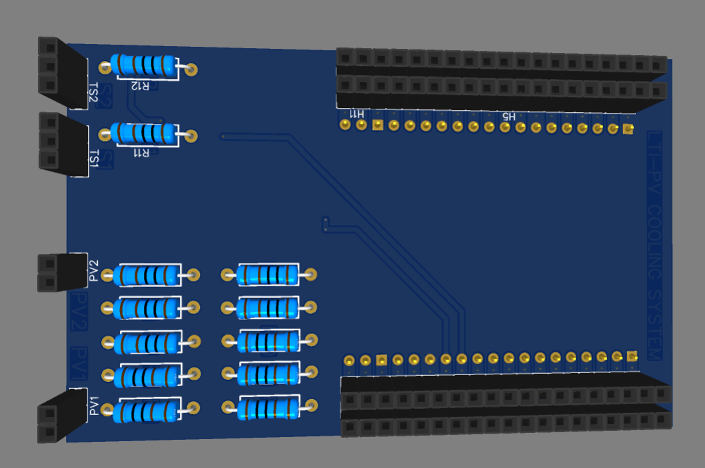
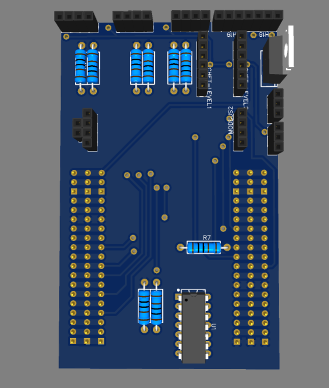

---

## 4. Outils de conception & méthodologie

- CAO PCB : EasyEDA / KiCad  
- Conception pilotée par schéma  
- Vérification mécanique en 3D  
- Conception orientée prototypage et validation en laboratoire  

La fabrication et la validation sont réalisées en fonction du calendrier du
projet.

---

## 5. Notes sur l’état d’avancement du projet

Certains PCB présentés ici sont :
- entièrement fabriqués et testés
- au stade de conception ou de routage
- en attente de fabrication

Chaque carte est **clairement identifiée par son statut actuel** afin de
distinguer le travail de conception du matériel validé.

Cette page est mise à jour progressivement au fur et à mesure de la fabrication
et des tests des cartes.
